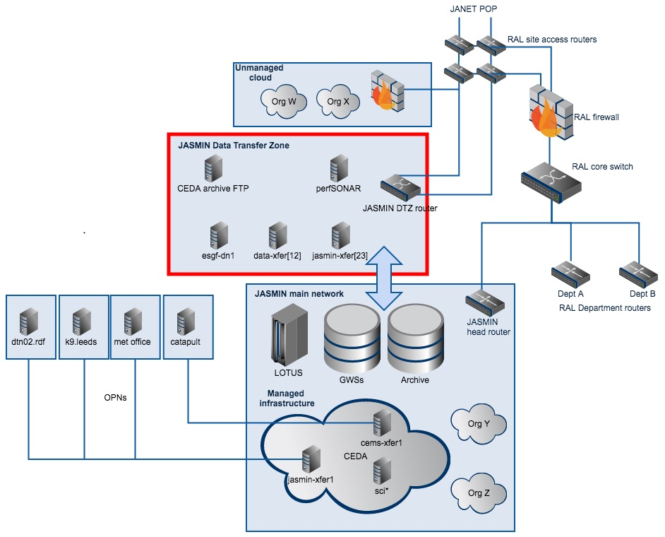

**NOTE [January 2021]** This article is now out of date. Some terminology,
names and components are no longer current. A newer version will be posted
here in due course.

This article describes the external connections used to enable movement of
data in to and out of JASMIN. It covers:

  * Local network environment
  * JANET network (main academic network connection)
  * Optical Private Network connections to specific sites
  * JASMIN Data Transfer Zone
  * JASMIN Unmanaged Cloud connectivity

## Local Network Environment

JASMIN resides within the STFC Rutherford Appleton Laboratory (RAL) site
network, which is currently connected at 4 x 10Gbit/s to the JANET backbone,
as shown in Figure 1, below. An internal ECMP non-blocking 40Gbit/s network
provides multi-Terabit/s performance within the JASMIN core, but is described
more fully elsewhere, e.g. this
[presentation](https://drive.google.com/file/d/0BwP1-0QGmA7_aU5QOTZ3eHBpMzA/view).

Figure 1. JASMIN Network.

The RAL site access routers form the JANET Point of Presence (POP) on the RAL
site and connect the RAL site network to the JANET backbone: the high-
throughput core of the UK's academic and research network.

The main (managed) part of the JASMIN infrastructure is served by the JASMIN
head router, equivalent in function to other RAL departmental routers.
Although CEDA is organisationally located within RAL Space, JASMIN itself is
physically located within the Scientific Computing Department, but has its own
head router.

Most of the main JASMIN compute and storage is housed within the Managed
Infrastructure, including the scientific analysis servers (sci*), along with
transfer servers jasmin-xfer1.ceda.ac.uk and cems-xfer1.ceda.ac.uk. The LOTUS
processing cluster, and fast storage used for Group Workspaces and the CEDA
archive are also in this zone.

## Optical Private Network connections to specific sites

Dedicated Optical Private Network (OPN) connections exist, connecting local
JASMIN/CEMS components with specific resources at remote sites. OPN
connections ensure a low latency (round-trip time) and dedicated bandwidth for
users of the link, as opposed to using the shared or public JANET connection.
These links are terminated on specific virtual hosts within the JASMIN managed
infrastructure, so it is only traffic between the specific resources listed
which uses the OPN route: traffic between other hosts at either the local or
remote ends will use the standard JANET backbone connection.

The following OPN links are provided:

Remote Site  |  Remote resources  |  Local resources  |  Bandwidth  
---|---|---|---  
ARCHER/RDF  |  ~~dtn02.rdf.ac.uk~~ (RDF no longer available)  |  |  
Leeds  |  k9.leeds.ac.uk  |  xfer[12].jasmin.ac.uk  |  1Gbit/s  
Met Office  |  ???  |  ???  |  1Gbit/s  
  
## JASMIN Data Transfer Zone

A special zone within the JASMIN network has been set up to enable high-
throughput science data transfers as efficiently as possible. The JASMIN Data
Transfer Zone has been adapted from the [ESnet "Science DMZ"
concept](https://fasterdata.es.net/science-dmz/).

A small number of specific services requiring high performance data transfer
capability are located in a zone which has a separate security policy to the
rest of the JASMIN network. This enables regular user traffic flows to be
handled by the RAL site firewall, while large-scale science data flows can
proceed as efficiently as possible.

Services within the JASMIN DTZ are hosted on high-performance physical
servers, each connected at 10Gbit/s* and with a separate internal link to the
fast storage to ensure efficient data flow. The security policy for this zone
usually requires that IP address of the remote host involved in the transfer
is known in advance and added to an "allow list". It is for this reason that
the additional "high performance data transfer service" access role is used to
capture this information when requesting access to some of these services.

(* this link is soon to be upgraded to 20Gbit/s)

The following services are currently provided within the JASMIN Data Transfer
Zone:

Service  |  Address  |  Description  |  Access  
---|---|---|---  
CEDA FTP service  |  ftp.ceda.ac.uk  |  Download-only access to CEDA archive
data  |  CEDA Account,  
Registration for access to specific datasets  
Transfer Server  |  hpxfer[12].jasmin.ac.uk  |  Tools available:  
scp, rsync, sftp  
lftp client  
bbcp (user install)  
ssh-based GridFTP (as server or client)  
jasmin-xfer3 has network tuning for long-path transfers  |  CEDA Account,  
jasmin-login,  
high-performance data transfer service  
GridFTP Server  |  gridftp1.jasmin.ac.uk  |  GSI/certificate-based GridFTP  
Globus Endpoint  |  CEDA Account,  
jasmin-login,  
high-performance data transfer service,  
Short-term credential provided by slcs.ceda.ac.uk  
ESGF Data Node  |  esgf-dn1.ceda.ac.uk  |  Download-only access to relevant
parts of CEDA archive via ESGF-specific GridFTP server (GSI/certificate-based
GridFTP and Globus Endpoint)  
|  ESGF credential and project registration  
perfSONAR node  |  perfsonar01.jc.rl.ac.uk  |  Monitoring of latency, packet
loss and throughput for JASMIN DTZ.  |  n/a  
  
## External tenancies in the JASMIN Community Cloud

The external part of the JASMIN Community Cloud resides in a portion of the
network belonging to NERC rather than STFC. This enables outward-facing
services maintained by non-STFC individuals to be operated from within the
unmanaged cloud.

It shares bandwidth to the outside world with the JASMIN Data Transfer Zone,
but has its own firewall router which can be used by the JASMIN infrastructure
management as an "emergency stop" if circumstances dictate.

Tenants within the unmanaged cloud manage their own UID/GID space and are not
governed by the central LDAP used in the main JASMIN infrastructure. This is
one reason why there is no direct connectivity from the unmanaged cloud to
filesystem resources such as the CEDA archive or Group Workspaces, since these
resources rely on LDAP to provide access control. However, as can be seen in
the network diagram (Fig. 1) above, use of the services within the JASMIN DTZ
gives access to data resources via the standard interfaces (e.g. FTP) which
are very proximal in the network sense and should provide good performance.

Further work is currently underway to explore ways of enabling access to data
resources from the unmanaged cloud via other methods.

