This article describes how to deploy and use the JASMIN Cluster-as-a-Service
(CaaS) Identity Manager.

## Introduction

The Identity Manager consists of a
[FreeIPA](https://www.freeipa.org/page/Main_Page) server, a
[Keycloak](https://www.keycloak.org/) server and a gateway/proxy server that
work together to provide a single identity across all cluster types, whether
via a web-browser, SSH or custom CLI tools like `kubectl`.

[FreeIPA](https://www.freeipa.org/page/Main_Page) is an open-source identity
management system specifically designed to manage Linux hosts and the user
accounts on those hosts. To do this, It integrates
[LDAP](https://en.wikipedia.org/wiki/Lightweight_Directory_Access_Protocol),
[Kerberos](https://en.wikipedia.org/wiki/Kerberos_\(protocol\)),
[NTP](https://en.wikipedia.org/wiki/Network_Time_Protocol),
[DNS](https://en.wikipedia.org/wiki/Domain_Name_System) and a [certificate
authority](https://en.wikipedia.org/wiki/Certificate_authority) into a single
unit that is easy to install and configure.

[Keycloak](https://www.keycloak.org/) is an open-source product that provides
single sign-on (SSO) using [OpenID Connect](https://openid.net/connect/) and
[SAML](https://en.wikipedia.org/wiki/Security_Assertion_Markup_Language),
primarily aimed at web-based services.

FreeIPA and Keycloak are powerful systems, and a full discussion of their
capabilities is beyond the scope of this article. This article focuses on
their use within the CaaS system, and will be sufficient for the vast majority
of users. **Any usage that deviates from that described in the JASMIN CaaS
documentation is not explicitly supported, should something go wrong.**

All hosts deployed using CaaS are registered with the FreeIPA instance for
your tenancy, and FreeIPA provides DNS, user/group management and access
control policies for those hosts. FreeIPA is also the single source of truth
for users and groups on your clusters. It is **not** possible to link with
other accounts, including JASMIN accounts. Keycloak is used to provide OpenID
Connect support for web applications, and for Kubernetes authentication.
Although Keycloak can manage its own users and groups, in the Identity Manager
setup it consumes the users and groups from FreeIPA via the LDAP integration
in order to provide a single user account across all clusters.

The web interfaces for FreeIPA and Keycloak are exposed through a single
gateway/proxy host. This host is also configured to allow SSH access for all
active users, which means it can be used with [SSH agent
forwarding](https://www.ssh.com/ssh/agent#sec-SSH-Agent-Forwarding) as a [jump
host](https://en.wikipedia.org/wiki/Jump_server) for SSH access to clusters
without an external IP (similar to the way that the [jasmin-login servers
work](login)).

The Identity Manager does not have self-service user registration or password
reset - these operations must be performed by an admin on behalf of the user.

## Cluster configuration

The following variables are available when creating an Identity Manager:

  
|  Description  |  Required?  |  Can be updated?  
---|---|---|---  
External IP  |  The external IP that will be attached to the gateway host.  
  
This is the the IP that can be used as a jump host for SSH access.  |  Yes  |
No  
Admin password  |  The password for the `admin` account. When the Identity
Manager is created, this is the only user that exists.  
  
Please make sure you choose a secure password.  
  
**WARNING: This password cannot be changed.** Changing the admin password in
the FreeIPA web interface will break cluster configuration for all clusters.
|  Yes  | No  
  
Admin IP ranges  |  One or more IP ranges from which admins will access the
FreeIPA and Keycloak web interfaces, in [CIDR
notation](https://en.wikipedia.org/wiki/Classless_Inter-
Domain_Routing#CIDR_notation). Any attempt to access the admin interfaces from
an IP address that is not in these ranges will be blocked.  
  
FreeIPA and Keycloak allow the creation and modification of users and
permissions for all your clusters, so it is recommended that this range be as
small as possible.  
  
If you are not sure what value to use here, contact your local network
administrator to find out the appropriate value for your network.  
|  Yes  |  Yes  
FreeIPA size  |  The machine size to use for the FreeIPA server.  |  Yes  |
No  
Keycloak size  |  The machine size to use for the Keycloak server.  |  Yes  |
No  
Gateway size  |  The machine size to use for the gateway server.  |  Yes  |
No  
Gateway domain  |  The domain to use for the gateway server.  
  
If left empty, `<dashed-gateway-ip>.sslip.io` is used (this uses the
[sslip.io](https://sslip.io/) service). For example, if the selected gateway
IP is `192.171.139.83`, the domain will be `192-171-139-83.sslip.io`.  
  
If given, the domain must already be configured to point to the **External
IP** , otherwise configuration will fail. Only use this option if you have
control over your own DNS entries - the CaaS system will **not** create a DNS
entry for you.  |  No  |  No  
  
Once configuration is complete, the FreeIPA web interface will be available at
`https://<gateway domain>`. You should be able to authenticate with the
username `admin` and the password that was given at deployment time:

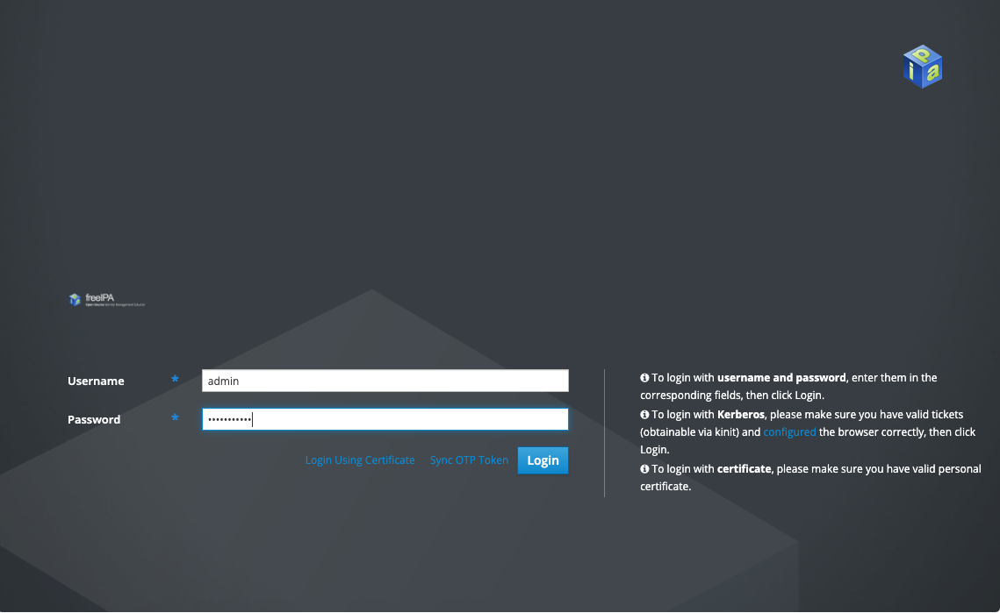

The Keycloak web interface is available at `https://<gateway domain>/auth/`.
You should be able to authenticate with the same username and password as
FreeIPA.

## Managing users

The users of your clusters are not related in any way to JASMIN users - in
fact, there is no requirement that the users of your clusters have a JASMIN
account. The pattern we encourage is that one or more admins with JASMIN
accounts and access to the JASMIN Cloud Portal deploy and maintain clusters on
behalf of their users. Those admins can then create user accounts and grant
access to clusters for their own users without those users even needing to be
aware of JASMIN.

### Creating a user

To add a new user, first log in to the FreeIPA interface. **Do not add users
via the Keycloak interface.** You will be taken to the users panel, where you
click the **Add** button:

This will pop up a dialogue for you to populate some basic information about
the user. The **User login** , **First name** , **Last name** and **New/Verify
password** fields are the ones that need to be populated. Pick a strong
password for the user - they can change this later via the FreeIPA interface
if they wish:

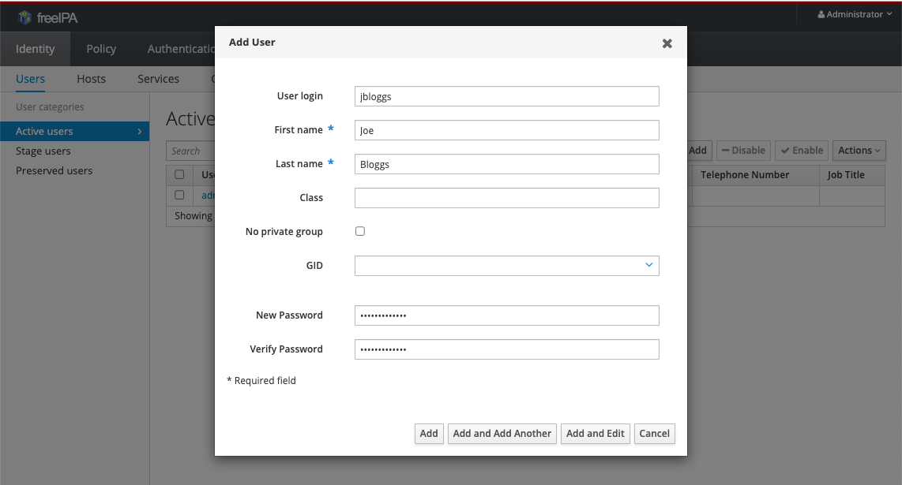

Click **Add** to create the user. You must then securely distribute this
password to the user - if possible, write it down and give it to them in
person, otherwise use an encrypted email.

The first time they log in, they will be asked to set a new password. Make
sure they do this as soon as possible:

The newly added user cannot do anything except view the users and modify some
of their own information. They can see, but not edit, their group memberships.

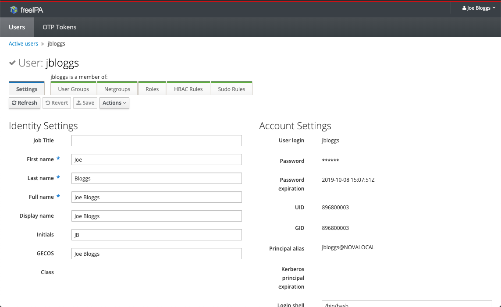

### Adding an SSH public key

Adding an SSH public key can be done either by the user themselves or by an
admin. First, navigate to the details page for the user. In the **Account
Settings** section, there is an item called **SSH public keys**. Click the
**Add** button next to it:

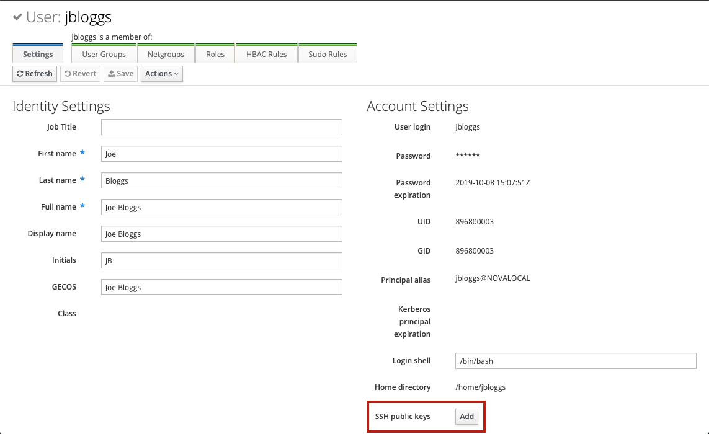

This will open a dialogue where the SSH public key can be entered:

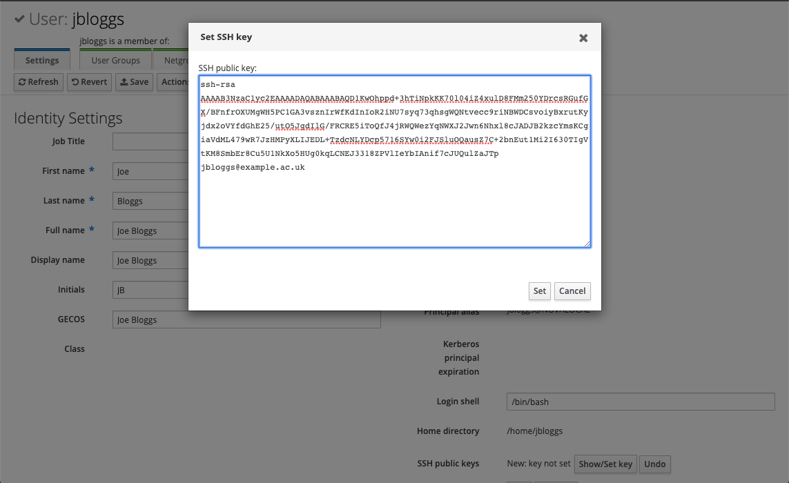

After clicking **Set** , the user interface will show **New: key set** under
the **SSH public keys** item. However, the key is not preserved until the user
is saved by clicking the **Save** button:

Once saved, the content of the **SSH public keys** item will change to a
fingerprint, which means the key was saved correctly. The key can be updated
or deleted at any point in the future if the associated private key is
compromised or lost:

### Changing a user's password

FreeIPA has no facility for self-service password reset, however users can
change their own password or an admin can reset it on their behalf. The
procedure is the same in both cases, except that when changing their own
password the user is required to provide their current password as well as the
new one.

To change a user's password, first navigate to the user details page then
select **Reset password** from the **Actions** dropdown:

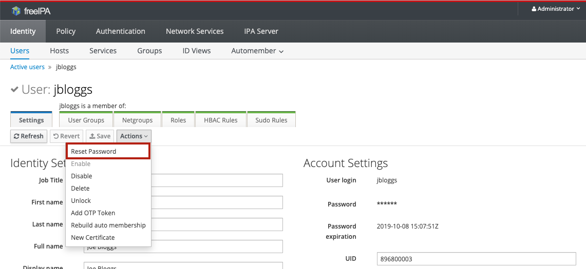

This will open a dialogue where a new password can be entered. An admin
changing the password on behalf of another user will only see the **New/Verify
Password** fields:

A user resetting their own password will also see **Current Password** and
**OTP** fields. The current password must be provided. OTP can be ignored.

After clicking **Reset Password** , the password is changed.

If a user's password is reset by an admin, the user will be asked to change
their password the first time they log in, like when a new user is created.

### Deleting a user

To delete a user, navigate to the **Identity > Users > ****Active users**
page. On this page, check the box next the user you want to disable, then
click the **Delete** button:

In the confirmation dialogue that pops up, make sure to select **preserve** as
the **Delete mode** \- it is not recommended to permanently delete users:

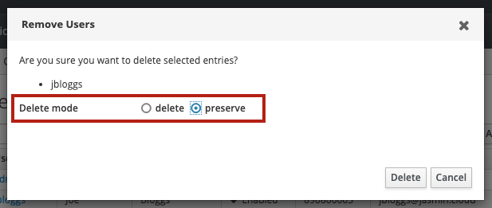

Upon clicking the **Delete** button, the user will be moved to the **Preserved
users** section:

They will no longer show up as a user on any CaaS hosts or in Keycloak. They
can be easily restored by selecting the user and clicking the **Restore**
button.

## Managing groups

When you deploy a cluster through CaaS, it may create one or more access
control groups in FreeIPA as part of it's configuration. Some clusters can
also consume additional groups created in FreeIPA. This is discussed in more
detail in the documentation for each cluster type, but the way you manage
group membership is the same in all cases.

### Creating a new group

To create a new group, navigate to the **Identity > Groups > User groups**
section and click the **Add** button:

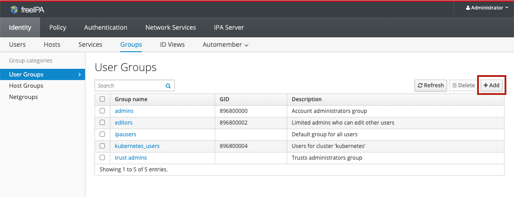

In the resulting dialogue, set the **Group name** and, if you wish, a
**Description** (recommended!). The **Group Type** can be left as **POSIX** ,
even if the group is only to be used for OpenID Connect. By leaving **GID**
empty, a free GID will be allocated:

After clicking the **Add** button, the new group will be available for adding
users.

### Adding and removing users

First, navigate to the **Identity > Groups > User groups** section:

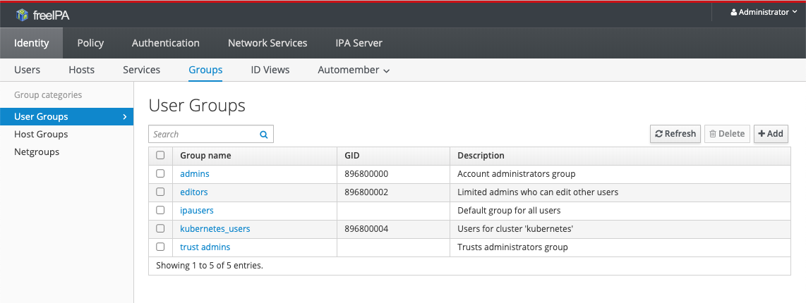

Click on the group that you want to add/remove users for to get to the details
page for that group. To add users, click the **Add** button:

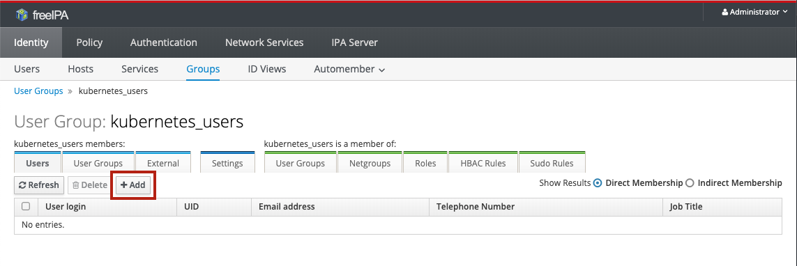

In the dialogue that pops up, select the users you want to add and click the
**>** button to move them from **Available** to **Prospective** :

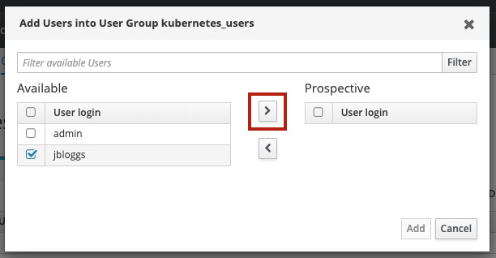

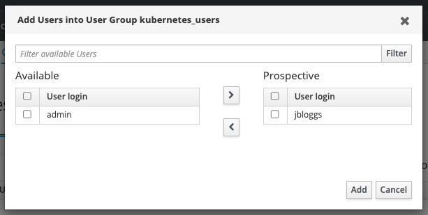

Click **Add** to add the users to the group.

To remove users from a group, select them in the user list for the group and
click **Delete** :

Upon confirmation, the users will be removed from the group.

### The admins group

There is one special group that is created in FreeIPA by default, called
`admins`. This group is respected by all cluster types and members are granted
permissions across all clusters deployed using CaaS, including (but not
limited to):

  * Full admin access to the FreeIPA and Keycloak web interfaces
  * SSH access to all hosts deployed using CaaS
  * `cluster-admin` access to all Kubernetes clusters
  * Access to all Pangeo clusters

## Managing OpenID Connect clients

For an application to use OpenID Connect to authenticate users, it must first
be registered as a client with Keycloak. Clients are issued with an ID and
secret so that Keycloak knows which application is making an authorisation
request.

To manage your OpenID Connect clients, go to Keycloak at `https://<gateway
domain>/auth/` and click **Administration Console**. Upon signing in with
valid admin credentials (see The admins group above) you will be redirected to
the Keycloak admin console. Click on **Clients** in the menu to see the list
of clients:

Keycloak itself uses OpenID Connect to handle authentication for its web and
command-line interfaces, so there are several clients related to Keycloak
operations. CaaS will also automatically create new OpenID Connect clients for
clusters that need them - most notably Kubernetes clusters - in which case the
client will be named after the cluster. The client with **Client ID**
`kubernetes` in the list above is an example of a client created by CaaS.

In order to configure an OpenID Connect client to talk to Keycloak, you also
need the client secret. To find out the secret for a client, click on the
client and then click on the **Credentials** tab:

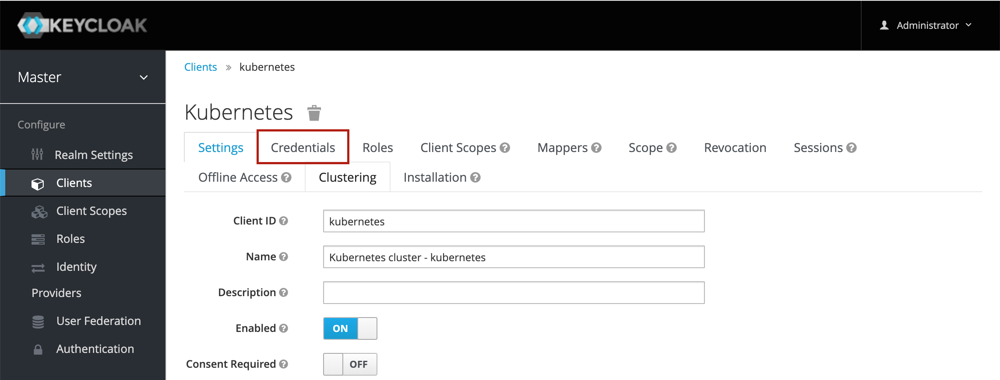

The client secret is then shown in a disabled text box, where it can be copied
from:

