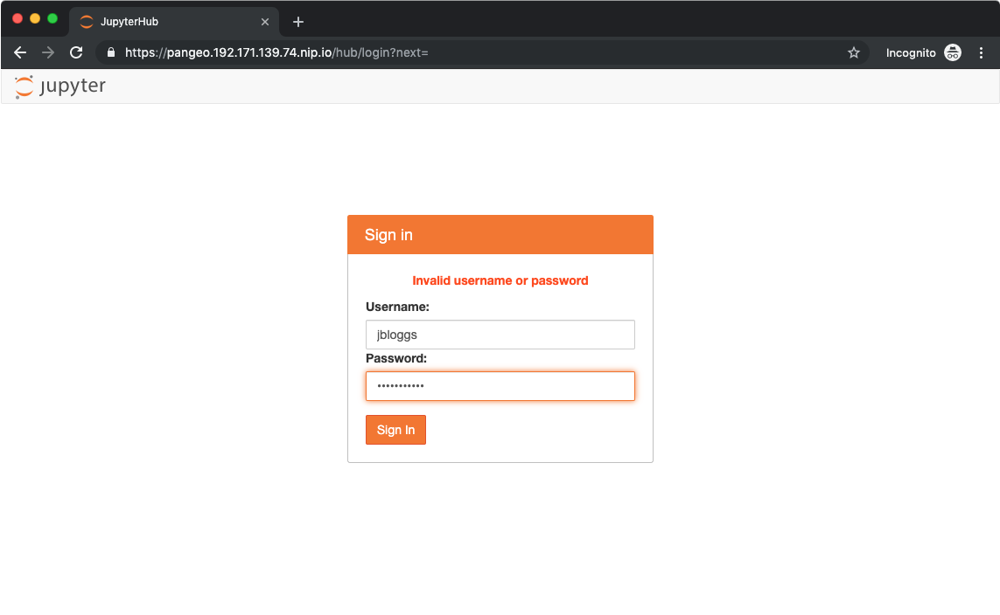
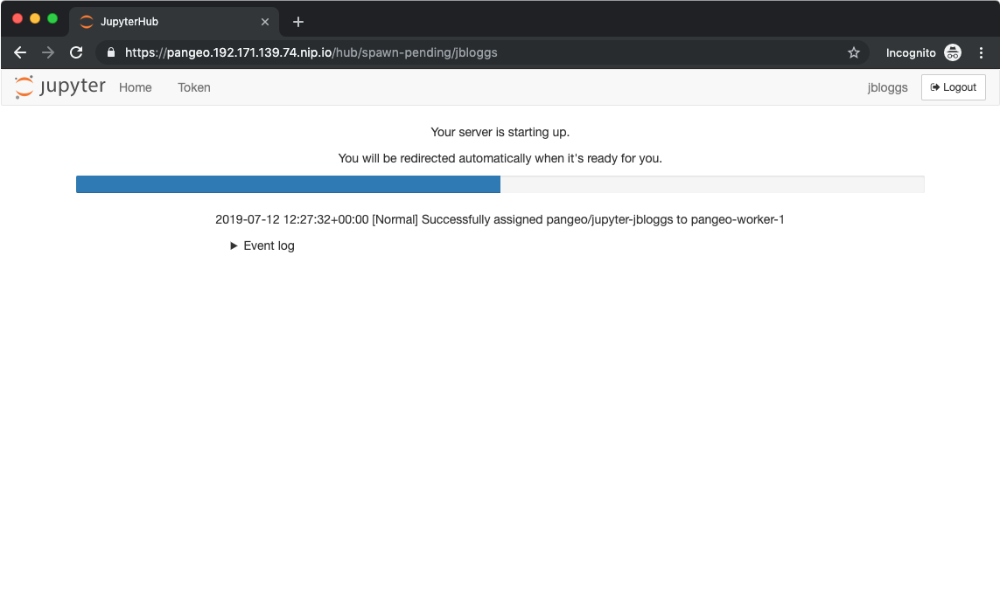
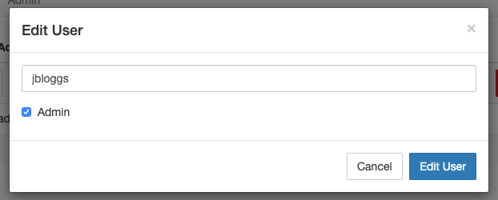

This article describes how to deploy and use a Pangeo cluster using JASMIN
Cluster-as-a-Service (CaaS).

## Introduction

[Pangeo](https://pangeo.io/) is a community that promotes a philosophy of
open, scalable and reproducible science, focusing primarily on the
geosciences. As part of that effort, the Pangeo community provides a curated
[Python](https://www.python.org/) ecosystem based on popular open-source
packages like [xarray](http://xarray.pydata.org),
[Iris](https://scitools.org.uk/iris), [Dask](http://dask.readthedocs.io) and
[Jupyter notebooks](http://jupyter.org/), along with documentation and recipes
for deployment on various infrastructures.

The Pangeo cluster type in CaaS is a multi-user implementation of the Pangeo
ecosystem using [JupyterHub](https://jupyter.org/hub) deployed on
[Kubernetes](https://kubernetes.io/), giving users a scalable and fault-
tolerant infrastructure to use for doing science, all through a web-browser
interface. Authentication is handled by the [Identity Manager]() for the tenancy via JupyterHub's
LDAP integration. Each authenticated user gets their own Jupyter notebook
environment running in its own container, isolated from other users. The
automatic spawning of containers for authenticated users is handled by
JupyterHub, which also provides an interface for admins to manage the running
containers. This is achieved by using the [Pangeo Helm
chart](https://github.com/pangeo-data/helm-chart) to deploy the Pangeo
ecosystem on a [CaaS Kubernetes cluster]().

## Cluster configuration

The Pangeo ecosystem is deployed on top of CaaS Kubernetes, so all the
[configuration variables for Kubernetes]() also apply to Pangeo clusters.

In addition, the following variables are available to configure the Pangeo
installation:

|  Description  |  Required?  |  Can be updated?  
---|---|---|---  
Notebook CPUs  |  The number of CPUs to allocate to each user notebook
environment.  |  Yes  |  Yes  
Notebook RAM  |  The amount of RAM, in GB, to allocate to each user notebook
environment.  |  Yes  |  Yes  
Notebook storage  |  The amount of persistent storage, in GB, to allocate to
each user notebook environment.  
  
This is where users will store their notebooks and any other files they
import. The storage is persistent across notebook restarts - a user can shut
down their notebook server and start a new server later without losing their
data.  
  
Backups are not provided - if required, they are the responsibility of the
user or cluster admins.  |  Yes  |  Yes  
Pangeo domain  |  The domain to use for the Pangeo notebook web interface.  
  
If left empty, `pangeo.<dashed-external-ip>.sslip.io` is used. For example, if
the selected external IP is `192.171.139.83`, the domain will be
`pangeo.192-171-139-83.sslip.io`.  
  
If given, the domain must already be configured to point to the selected
**External IP** (see Kubernetes configuration), otherwise configuration will
fail. Only use this option if you have control over your own DNS entries - the
CaaS system or Kubernetes will not create a DNS entry for you.  |  No  |  No  
  
These variables define the amount of resource available to each user for
processing - in order to appropriately configure (a) the size of your cluster
worker nodes and (b) the resources for each notebook environment, you will
need to consider how many users you are expecting and what workloads they
might want to run.

## Accessing the cluster

Access to the underlying Kubernetes cluster is achieved in the [same way as
any other CaaS Kubernetes cluster]().

The Pangeo web interface will be available at `https://<pangeo domain>`.
Access to the Pangeo interface is managed through FreeIPA, and users sign in
with the same username and password as for other clusters. As part of the
cluster configuration, CaaS will create a [FreeIPA group]() called `<clustername>_notebook_users`.
Granting access to the Pangeo interface is as simple as adding a user to this
group.

Before adding user to group:

And after:

## Using the Pangeo environment

A full discussion of the capabilities of Jupyter notebooks, the JupyterLab
environment and the many libraries included in the Pangeo ecosystem is beyond
the scope of this documentation. There are plenty of examples on the web, and
Pangeo provide some [example notebooks](https://github.com/pangeo-data/pangeo-
example-notebooks).

As a very brief example of the power and simplicity of Jupyter notebooks,
especially on Kubernetes, this short video (no sound) shows a user signing
into a CaaS Pangeo cluster and uploading a notebook. When run, the notebook
spawns a Dask cluster inside Kubernetes and uses it to perform a noddy but
relatively time-consuming calculation. You can see the Dask cluster scale up
to meet demand in the Dask dashboard:

## Administering the hub

JupyterHub allows admin users to manage the notebooks running in the system,
and even to impersonate other users. Unfortunately, the JupyterHub LDAP
integration does not currently allow for an entire group to be designated as
admins, so admin access in JupyterHub is granted specifically to the FreeIPA
`admin` user.

To access the admin section, first click **Hub > Control Panel** in the
JupyterLab interface:

This will open the JupyterHub control panel - any user can use this to start
and stop their notebook server, but admins see an extra **Admin** tab:

Clicking on this tab will show a list of the users in the hub, along with
buttons to start and stop the servers for those users:

Additional admins can be added by clicking the **edit user** button for that
user. This will pop up a dialogue:

Check the **Admin** checkbox and click **Edit User** to save. The user is now
an admin for the hub.

