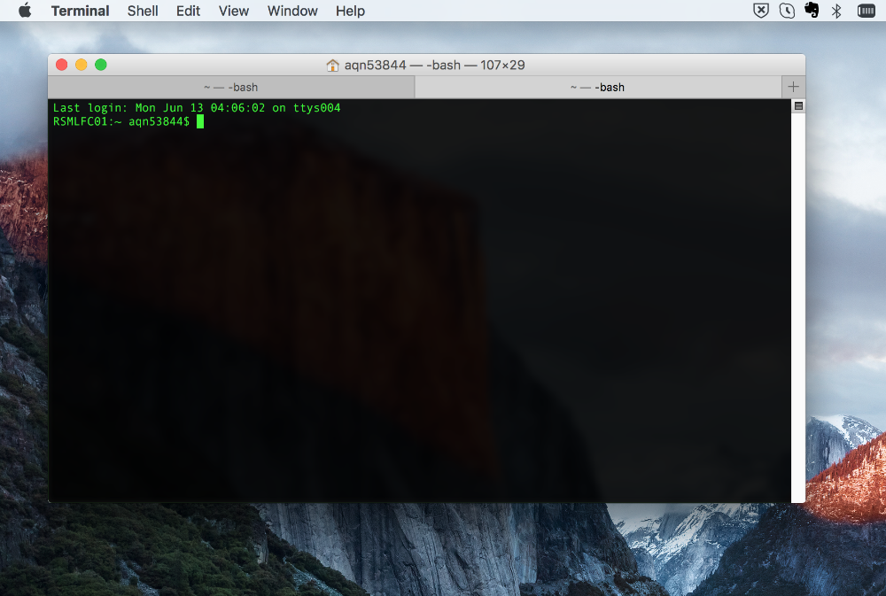
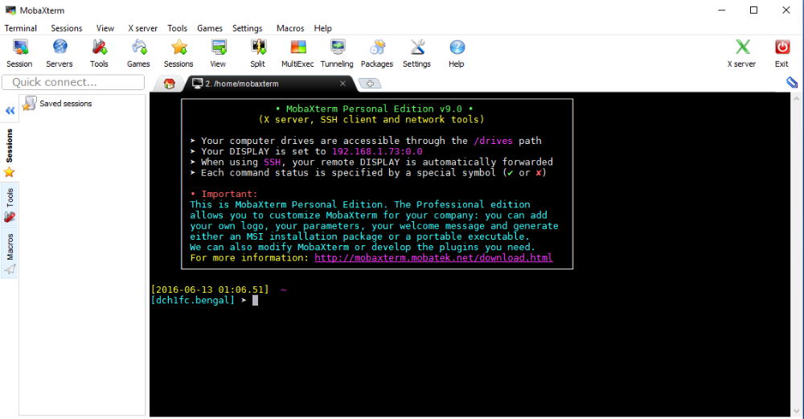

This article explains how to create an SSH key pair for logging in to JASMIN.
It covers:

  * The shell terminal
  * Using `ssh-keygen` to create an SSH key pair
  * Converting a PuTTYGen private key for use with MobaXterm (Windows only)

You can also use this procedure to update an existing SSH key pair for JASMIN.
However, if you are experiencing problems logging in to JASMIN you are advised
to first check [Login problems](login-problems) and then contact [JASMIN
support](https://www.jasmin.ac.uk/help/contact/) before changing your key.
Once you have created your SSH key pair it will need to be uploaded to the
JASMIN accounts portal. If this is the first time you have created a key pair
then this will be done when you create an account on the portal (Step 2 of
[Get Started with JASMIN](get-started-with-jasmin)). If you are updating your
key for an existing account then you will need to update it in your [JASMIN
profile](https://accounts.jasmin.ac.uk/account/login/?next=/account/profile/).

## The shell terminal

Generating an SSH key pair requires an SSH client and a Shell terminal. Linux
and Mac users can use a standard terminal which is very likely to have SSH
installed. Windows users are advised to [install the MobaXterm
application](mobaxterm) which provides a linux-style terminal with all the
relevant utilities included. Figures 1 and 2 show example terminal windows on
a Mac and Windows (using MobaXterm).



**Figure 1.** Screenshot of a shell terminal on a Mac.



**Figure 2.** Screenshot of a shell terminal using the MobaXterm client on
Windows.

## Using ssh-keygen to create an SSH key pair

The Linux command `ssh-keygen` should be used to generate your SSH key pair.
Open a terminal and generate your public and private key, as follows (replace
the e-mail address with your own:

```console
ssh-keygen -t rsa -b 2048 -C "me@somewhere.ac.uk" -f ~/.ssh/id_rsa_jasmin
```

At the prompt, type a **secure passphrase** to protect your SSH private key.
**This is a requirement for access to JASMIN machines. Use a new, different
passphrase whenever you generate a new key.** Note that nothing is echoed to
the screen when you enter your passphrase, so it may look like it is not
working.

The output will look something like this:
```console
Generating public/private rsa key pair.
Enter passphrase (empty for no passphrase): <ADD PASSPHRASE HERE>
Enter same passphrase again: <REPEAT PASSPHRASE HERE>
Your identification has been saved in /home/users/meuser/.ssh/id_rsa_jasmin.
Your public key has been saved in /home/users/meuser/.ssh/id_rsa_jasmin.pub.
The key fingerprint is:
74:14:95:8a:31:73:cc:5c:af:be:91:04:01:c2:39:0b me@somewhere.ac.uk
``` 

Running `ssh-keygen` will generate two files in your `$HOME/.ssh/` directory:

  * `id_rsa_jasmin` -  the private key file (which should have permission "400", i.e. readable only by you)
  * `id_rsa_jasmin.pub` - the public key file

The **public** key file is the part that you need to share in order to access
JASMIN. The **private** key file should be protected and not shared with
others.

{}
You should not store your JASMIN private key, or the private key used for any other multi-user system such as ARCHER2, anywhere on JASMIN. Keep this private on your local machine (laptop/desktop).
{}

## Converting a PuTTYGen SSH private key for use with MobaXterm (Windows only)

If you have previously used the
[PuTTY](https://www.chiark.greenend.org.uk/~sgtatham/putty/) utilities to
login to JASMIN and you wish to move over to using [MobaXterm](mobaxterm) then
please see these [instructions to convert your SSH private key from the
PuTTYGen format to the OpenSSH format](https://docs.oseems.com/general/application/putty/convert-ppk-to-ssh-key) (as used by Linux/Mac). Please save your resulting OpenSSH key as
`id_rsa_jasmin` in your `$HOME/.ssh/` directory.
