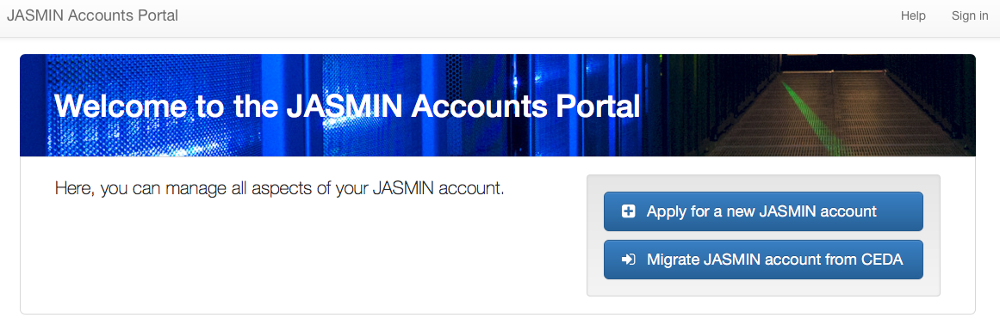
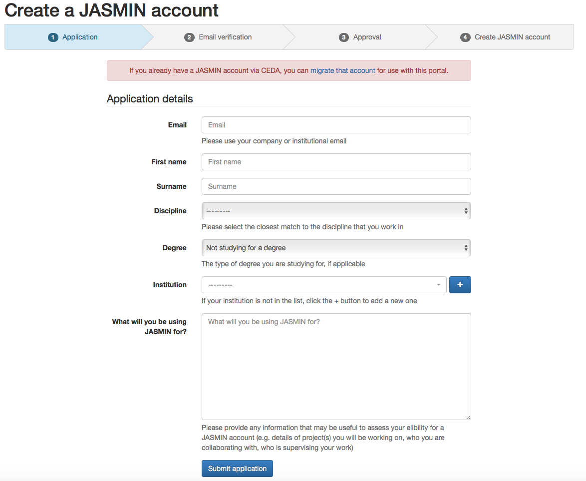
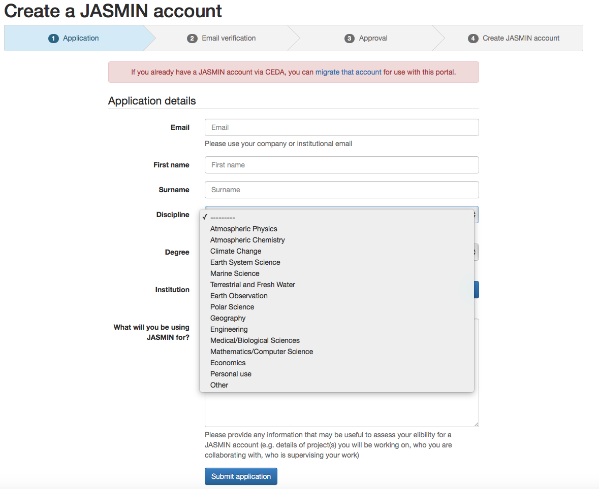
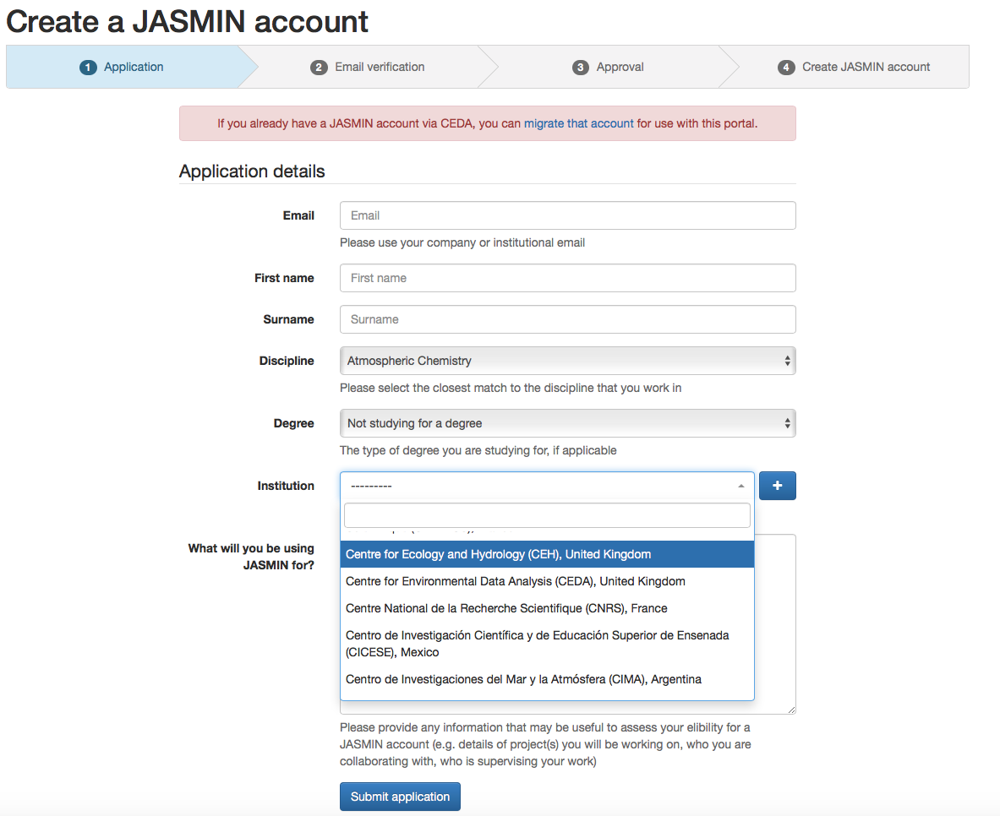
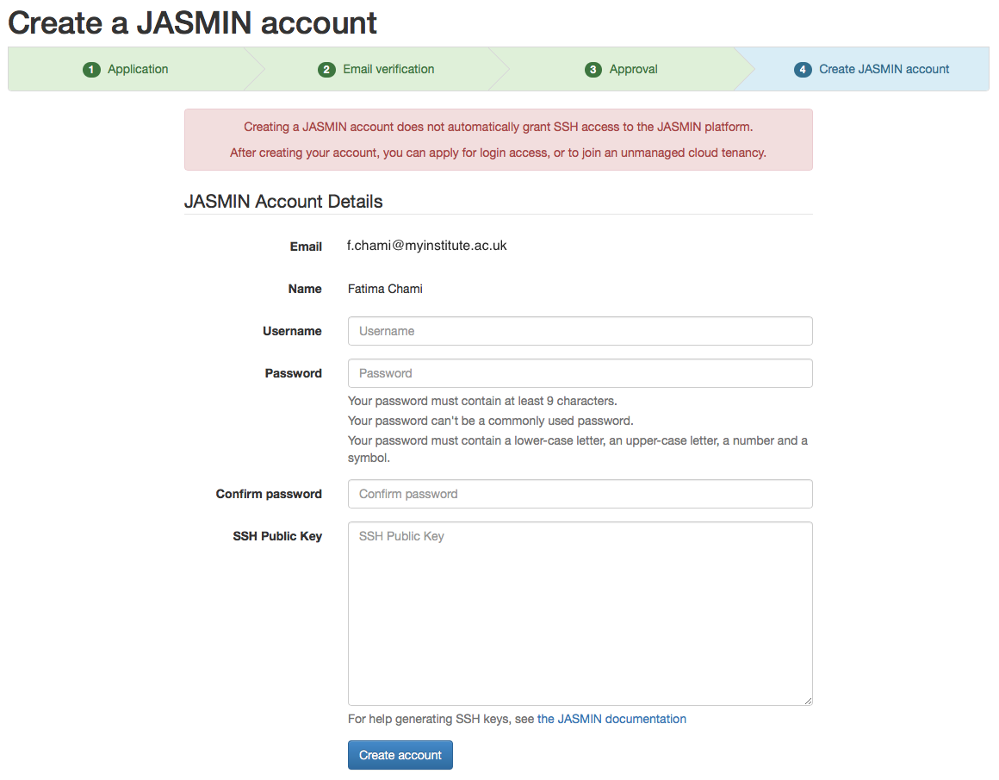
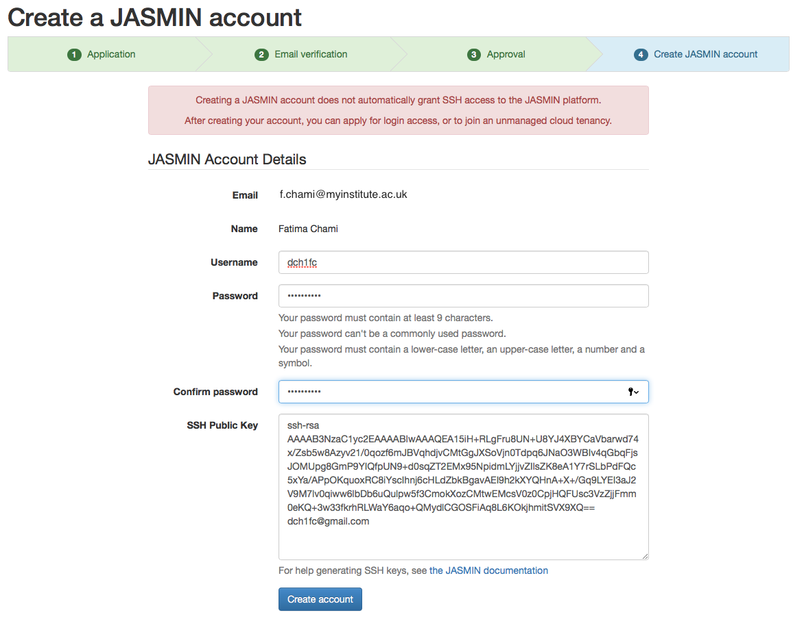
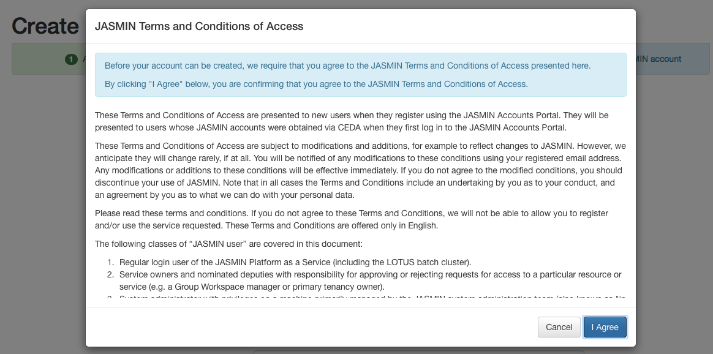
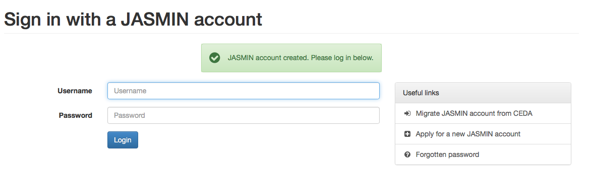

This article explains how to register on the JASMIN accounts portal.
Registering on the accounts portal allows you to apply for JASMIN services and
privileges. It does not by itself provide you with any access to JASMIN
machines or services.

If you wish to migrate an existing CEDA account please see:

  * [How to migrate an existing CEDA account using the JASMIN account portal]()

There is a video **tutorial** for the material covered in this article at
[Getting a new JASMIN
account](https://www.youtube.com/watch?v=UMrUB7UKNcc&index=2&list=PLyBwrm7gQcuV3I1zrI8Rop2WgEP6vPXJL)

## JASMIN account portal

The [JASMIN accounts portal](https://accounts.jasmin.ac.uk/) is a web
interface utility dedicated to JASMIN users only. This is standalone from
MyCEDA (your CEDA account) and hence a decoupling between the management of
access to JASMIN resources (compute and storage) and CEDA resources (access to
datasets in the archives).

## Apply for a new JASMIN account

To apply for a new JASMIN account you need to have your academic affiliated
email address. Then proceed as follows:

**Step 1** : On [JASMIN accounts portal](https://accounts.jasmin.ac.uk/)
select "Apply for a new JASMIN account". This will take you to the following
page to enter your details.

**Step 2** : Select your research discipline.

**Step 3** : Select the institution you are affiliated with. If your
institution is not listed, you can add new institution details by clicking the
plus button. Remember to provide supporting information to assess your
eligibility for a JASMIN account and then submit your application

**Step 4** : Follow the URL link sent to your email address. Once your email
has been verified, you will receive a second email with a subject 'Application
approved' inviting you to complete the account creation. This link will take
you to the following page where you have to choose your JASMIN account
credentials, **register your SSH public key** and then **click Create
account**

**Step 5** : An example of registering SSH public key

**Step 6** : Agree to the JASMIN Terms and Conditions of Access

**Step 7** : Your JASMIN account is created and you can log in using your
credentials

