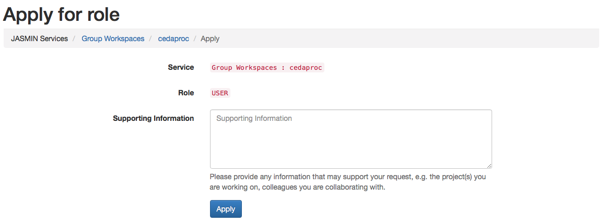

This article explains how to apply for access to the shared JASMIN servers.
There is a video **tutorial** available on [Access login server
](https://www.youtube.com/watch?v=SLeTq4VX6ok&index=3&list=PLyBwrm7gQcuV3I1zrI8Rop2WgEP6vPXJL)

## Get a login account

A user with a `  jasmin -login` account is allocated a HOME directory of
**100GB** and can access the shared JASMIN servers (Scientific servers, data
transfer servers,  and  LOTUS). Sign in into your [JASMIN accounts
portal](https://accounts.jasmin.ac.uk/) where you can apply for a JASMIN login
account representing the JASMIN access role appropriate to your affiliation.

**Step 1:** Select Login services and navigate to the 'More information' on
this service

**Step 2:** Apply for access to jasmin-login service

**Step 3:** Provide supporting information

**Step 4:** Your request is pending for approval

**Step 4:** Upon approval, a notification email is sent to you. Additionally,
a notification counter in the bell will appear on the top left corner of the
menu bar on your JASMIN account portal page. You have now access to the login
server and to the scientific servers

Under 'My Services' you can view all the services that you currently have
access to or have requested access for. Note: Every time a notification is
acknowledged the counter is reset or decremented.

Now you can proceed to [How to login](login)

