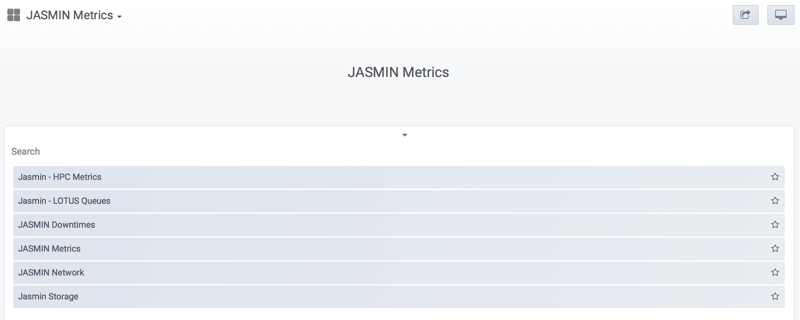
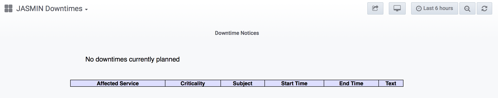
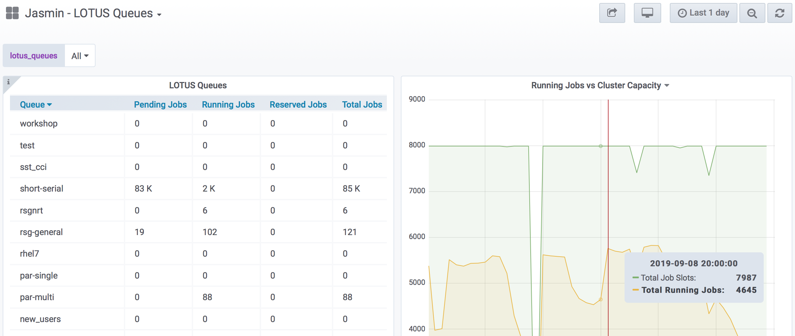

This article explains how to monitor the status of JASMIN services using the
Jasmin dashboard utility. It covers:

  * What is JASMIN dashboard?
  * How to identify downtimes or a system maintenance call 
  * JASMIN services status

## JASMIN dashboard

The [JASMIN dashboard](https://mon.jasmin.ac.uk) is a web interface to the
monitoring system of JASMIN services.

## Downtimes

"JASMIN Planned Downtimes" is updated on the JASMIN dashboard home page
(Figure 1). The  down time  period,  its criticality  and affected services
are displayed in the "JASMIN Planned Downtimes" table with additional comments
on the column "Text" of  this table .

## LOTUS Queues

The number of running jobs versus cluster capacity is displayed on the right
figure above.

