This article shows you how to update an active JASMIN account on the JASMIN
accounts portal:

  * Link your CEDA account
  * Update your SSH public key
  * Change password of your JASMIN account
  * Update your profile information

## Update your SSH public key

First, you need to generate a new SSH key pair as described here: [Generate an
SSH key pair](generate-ssh-key-pair). This should be done on your local
machine (e.g. Windows / Linux / Mac). You MUST protect your key with a strong
passphrase. Then follow step 1 to step 5 to update your SSH public key

**Step 1** : You need to login to your JASMIN accounts portal
<https://accounts.jasmin.ac.uk> and then click on your username (at the top
right corner of the page) to drop down the menu

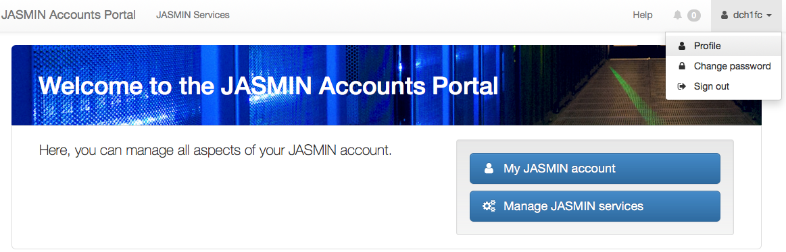

**Step 2** : Select "Profile". This will take you to the following page where
you can update your personal information and your SSH key

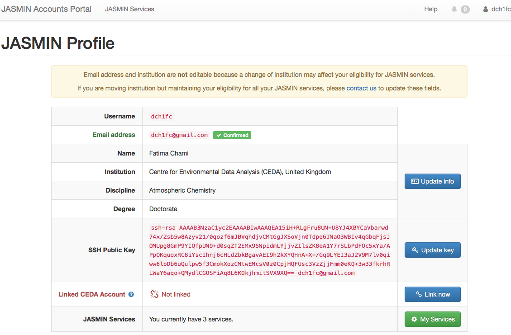

##

Step 3: On the profile page shown above) select "Update  key " which is next
to the "SSH Public Key" field. JASMIN accounts portal will send you a
validation token to your registered email address.

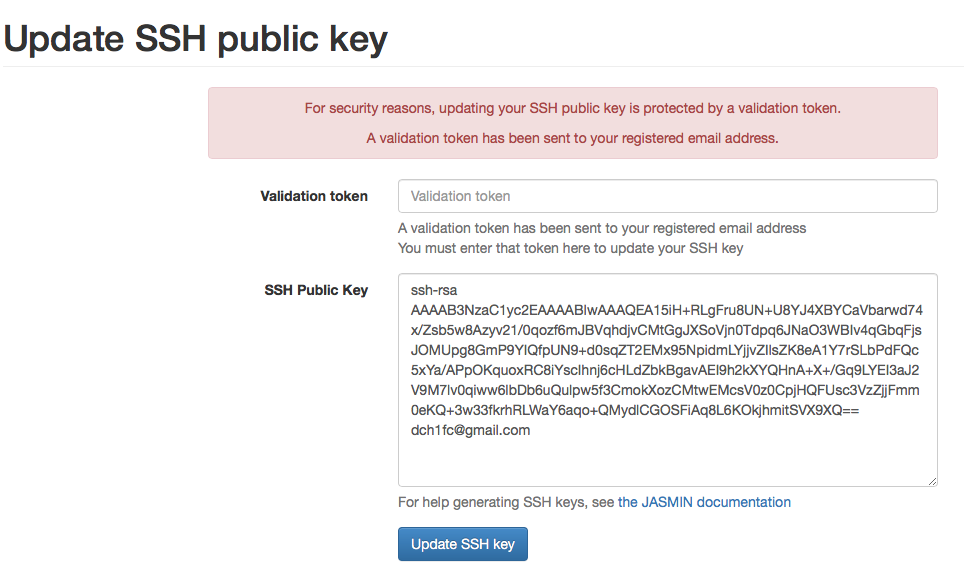

Step 4: Enter the validation token, **delete the old SSH public key** ,  and
paste the new SSH public key. Then click "Update SSH key" see below

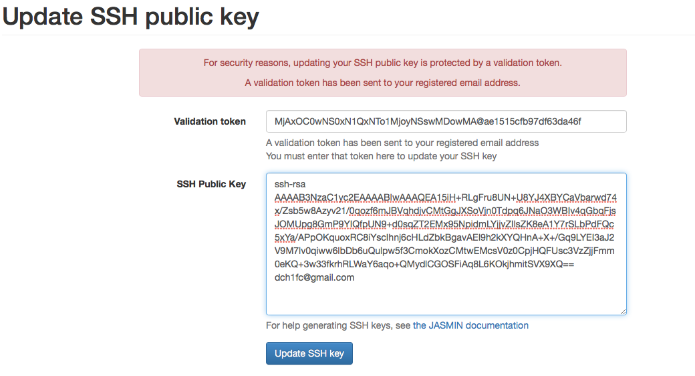

Step 5: A message confirming that SSH public key was updated is displayed on
the profile page. Note: Please allow 15 minutes before the new SSH key becomes
active on the JASMIN system and then attempt to login to JASMIN.

If you get the message "not a valid ssh public key" please check that you have
copied the text from the ".pub" file and that no newline characters are
include. The public key should be a single line of text with no newline
characters. It can be difficult to see this as the text automatically wraps
itself to fit in the text box.

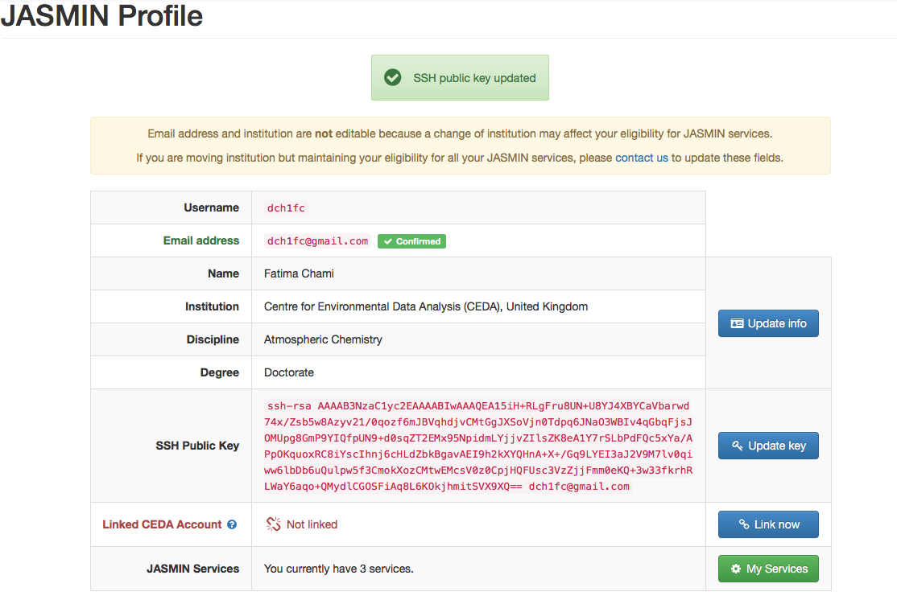

##

## Update info

**Step 1** : On the profile page, select "Update info". This will take you to
the following page where you can update your name, discipline, and degree.

**Note:** You can not update your email address and institution because a
change of institution may affect your eligibility for all JASMIN services. If
you are moving institution but maintaining your eligibility for all your
JASMIN services, please [contact us](http://www.jasmin.ac.uk/contact/) to
update these fields.

**Note:** If your profile contains a red button "Confirm now" next to the
email field, you need to [re-confirm your email address](reconfirm-email-
address) (this is a process which you will be asked to repeat on an annual
basis). If you have successfully completed this process, you should see a
green "confirmed" label as shown above.

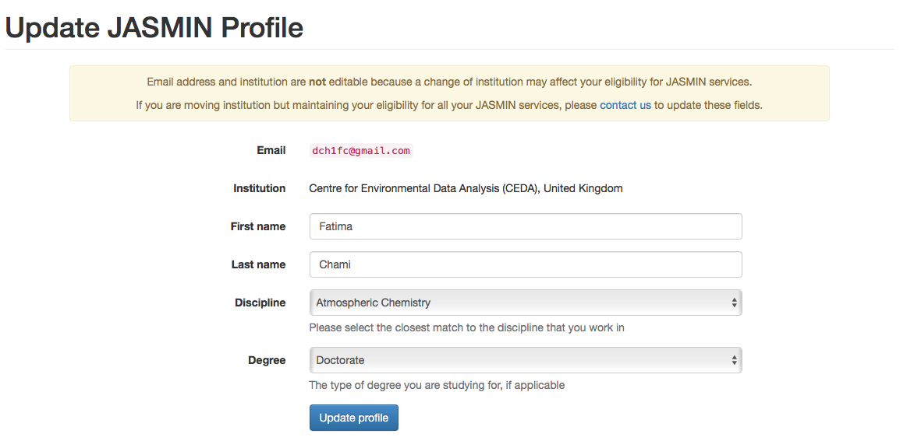

**Step 2** : Once the discipline and degree are updated, click "Update
profile"

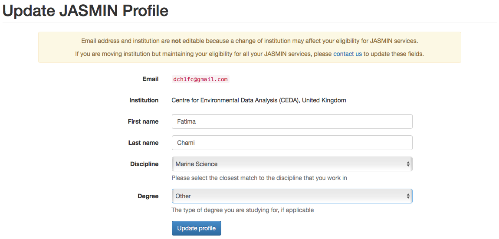

**Step 3** : from step 2 you will be taken to the updated profile page

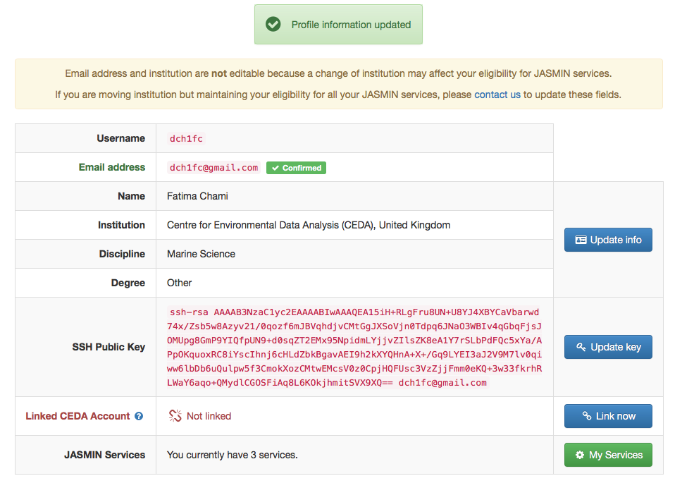

# Change password

**Step 1** : Select "Change password" from the drop-down menu at the top right
corner where your JASMIN account username is displayed.

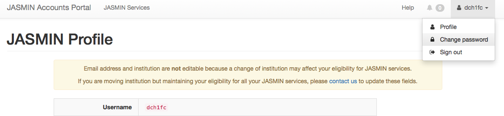

**Step 2** : Enter the new password which must contain at least 9 characters
and is not a commonly used password. Re-enter the new password for
confirmation. Then click "Change password"

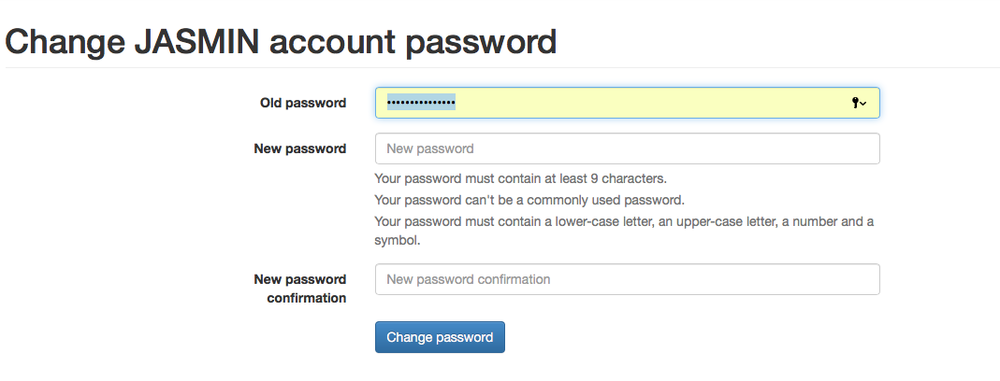

# Linking your CEDA account

Linking your CEDA account to your JASMIN account allows you filesystem access
to data on CEDA Archive. If you need to access data on the CEDA Archive and
you do not have an account, you will need to apply for a [CEDA account](get-
ceda-account).

**Step 1** : On the profile page, select "Link now" which is opposite to the
field "Linked CEDA Account". This will take you to the CEDA accounts portal
page where you need to login.

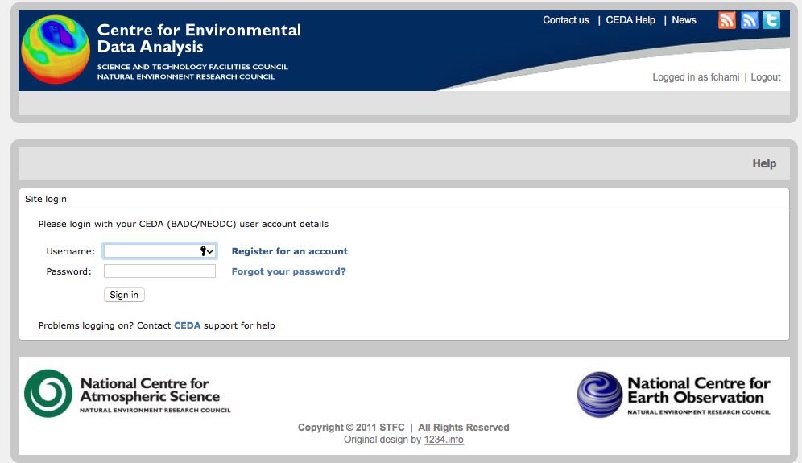

**Step** **2** : You will be directed to the page below to authorise JASMIN
accounts portal to link your CEDA account and read CEDA profile information.

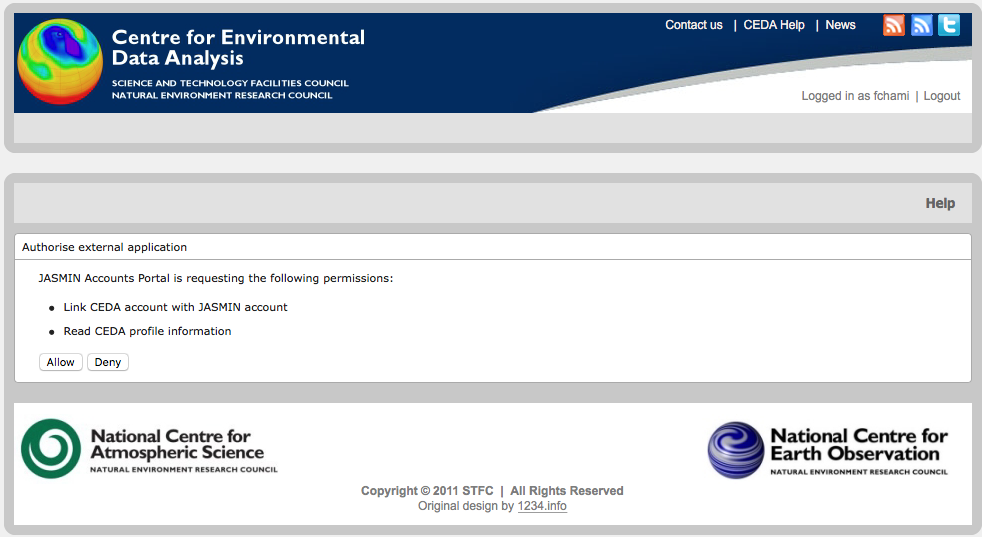

**Step 3** : Your "Linked CEDA Account" field on your JASMIN account profile
page will be updated as "Linked with <JASMIN username>" as shown below

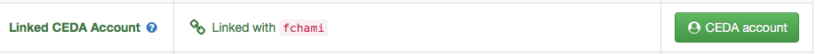

