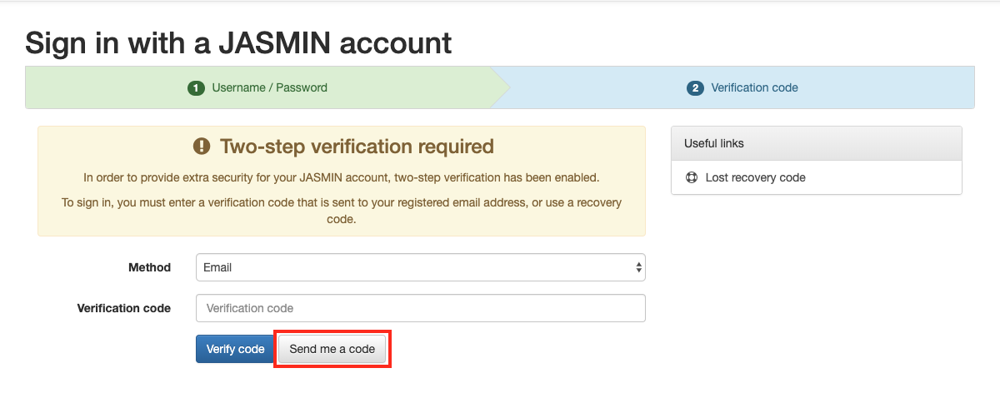
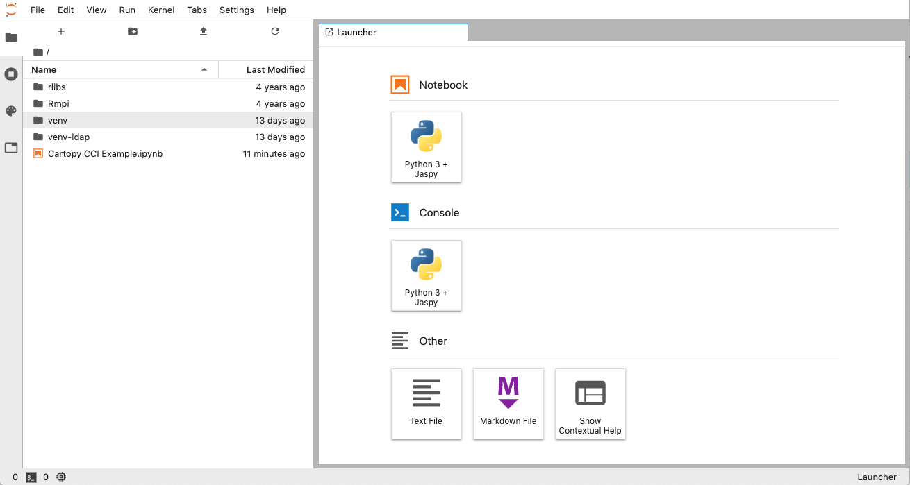
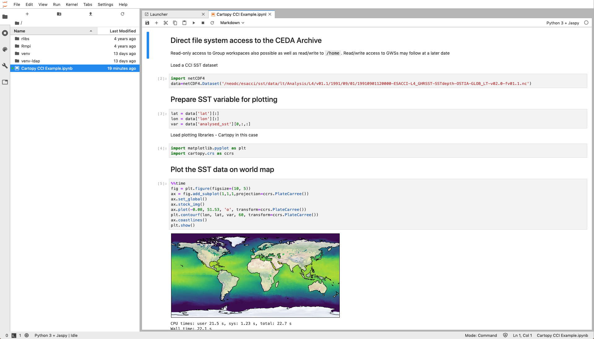
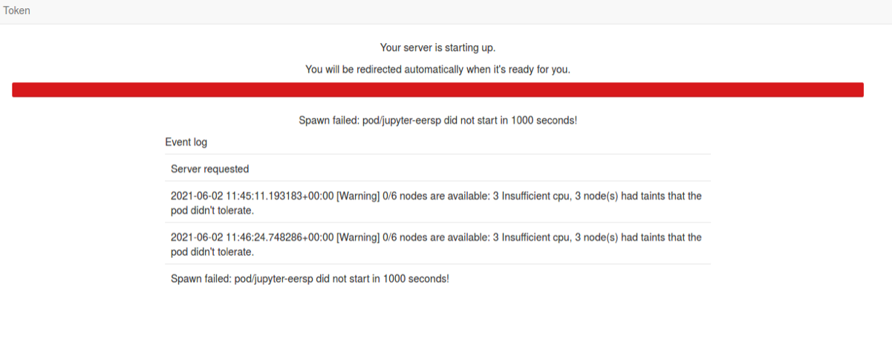

The JASMIN Notebook Service provides access to [Jupyter
Notebooks](https://jupyter.org/) in the web browser.

In this article:

  * What is a Jupyter Notebook
  * How to access a Jupyter Notebook 
  * How to use a Jupyter Notebook
  * Common issues and questions
  * Further info

## What is a Jupyter Notebook?

A Jupyter Notebook is an interactive document containing live code and
visualisations that can be viewed and modified in a web browser. These
documents can be shared, often using GitHub, and many projects distribute
example code as Jupyter notebooks. Users interact with their notebooks using
the open-source Jupyter Notebook server application.

Jupyter has support for many languages including Python, R, Scala and Julia,
which are implemented by plugins known as "kernels". The JASMIN Notebook
Service currently provides one kernel - Python 3.8 with the latest [Jaspy
software environment]() installed. This environment is
active by default, so there is no need for the `module` commands described in
the linked article. You can also install and use your own Python environments
as explained below.

Whilst it has been possible to use Jupyter Notebooks on JASMIN before now,
doing so has never been officially supported. The JASMIN Notebook Service uses
[JupyterHub](https://jupyter.org/hub) to manage multiple Jupyter Notebook
servers. After authenticating with a JASMIN account (with the correct access),
a user gets access to their own notebook server. The notebook server runs as
the authenticated user, and the user can access their home directory, Group
Workspaces and CEDA Archive data as they would from a scientific analysis
server.

## Getting access to the JASMIN Notebook Service

In order to access the JASMIN Notebook service, first, follow the steps in
[Getting started with JASMIN]() to get a
JASMIN account and the `jasmin-login` service.

**Important:** From 16/6/2021, access to the JASMIN Jupyter Notebook service
is controlled simply by having a valid `jasmin-login` grant. [2-step
verification](http://notebooks.jasmin.ac.uk/) is still required as shown
below, but it is no longer necessary to apply for and be granted the
additional `jupyter-notebooks` role, which is now deprecated.)

## Using the JASMIN Notebook Service

To use the JASMIN Notebook Service, navigate to
<https://notebooks.jasmin.ac.uk>. This will redirect you to the JASMIN
Accounts Portal, where you should sign in with your JASMIN Account. If you
have previously accessed the notebook service from the computer you are using,
this may happen automatically.

The first time you access the JASMIN Notebook Service from a new computer or
browser, you will be asked to verify your email address after signing in. To
do this, make sure the "Email" method is selected and click "Send me a code":

This will result in an email being sent to your registered email address
containing a six-digit verification code. Enter this code and press "Verify
code". Each code lasts between 15 and 30 minutes.

Upon successfully signing in and verifying your email if required, you will be
redirected back to the JASMIN Notebook Service. The service will then create a
notebook server for you to use, and you will see a loading page:

After a few seconds, or in some rare cases a minute or two, you will be taken
to the JupyterLab interface:

The folder shown in the left-hand panel will be your home directory on JASMIN,
exactly as if you had logged in to a scientific analysis server. Any changes
made in JupyterLab will be immediately reflected on the scientific analysis
servers and LOTUS, and vice-versa. You can then launch, edit and run Python
notebooks using the JupyterLab interface. Notebooks can access files from the
CEDA Archive, and also have read-only access to group workspaces. For example,
this notebook reads a file belonging to the CCI project from the CEDA Archive
and plots the data on a map:

A full discussion of the power of the JupyterLab interface is beyond the scope
of this documentation, but the [JupyterLab
documentation](https://jupyterlab.readthedocs.io/en/stable/) is excellent, and
there are many tutorials available on the internet.

### Intended usage and limitations

The JupyterLab environment provided by the JASMIN Notebook Service is
powerful, but it has some limitations that reflect the type of usage that we
want to encourage.

The service is primarily intended for interactively producing visualisations
of existing data, not for processing vast amounts of data. As such, the
resources made available to each notebook server are limited, and Group
Workspaces are only mounted in read-only mode. For heavy processing, users
should still use the [LOTUS batch processing system]()
before using the notebook service to visualise the data.

### Common issues and questions

#### I get "403 forbidden" when I try to access the JASMIN Notebook Service

This error occurs when you do not have the correct permissions to access the
JASMIN Notebook service. Please ensure you have been granted the `jasmin-login` and allow some time for the changes to propagate through the system.

#### Which software environment is used by the Notebook Service?

The JASMIN Notebook Service currently uses the **default Jaspy environment**
listed on the [Jaspy page]().

#### Can I install additional packages?

The recommended way to do this is to [create your own virtual environment in
the notebooks service and install additional packages into that.]() You can
make that virtual environment persist as a kernel to use again next time you
use the Notebooks service.

If you believe that the package is more widely applicable, you can request an
update to Jaspy.

#### Can I use a different software environment?

Yes, the article linked above also describes how to use Conda to create your
own custom environment.

####

#### I get "503 service unavailable" when I try to access the JASMIN Notebook
Service

This error occurs when your notebook server is unable to start. By far the
most common cause of this error is when you are over your quota in your home
directory. As part of starting up, Jupyter needs to create some small files in
your home directory in order to track state. When it is unable to do this
because you are over your quota, you will see the "503 service unavailable"
error.

If you see this error, try connecting to JASMIN using SSH and checking your
home directory usage. After clearing some space in your home directory, your
notebook server should be able to start again.

#### I get the following message when my notebook is queued for spawning

The message above indicates that the Notebook service
is oversubscribed -busy- and there are no resources available to start your
Notebook server. Please try again later!

Please use the scientific analysis server and LOTUS for processing and jupyter
Notebook for lighter visualisation.

## Example Notebooks

In support of the JASMIN Notebook Service, we have developed a GitHub
repository with a collection of Notebooks that demonstrate some of the
important features of the service. The following provides a general
introduction:

<https://github.com/cedadev/ceda-
notebooks/blob/master/notebooks/training/intro/notebook-tour.ipynb>

Other Notebooks can be found within the repository, under:

<https://github.com/cedadev/ceda-notebooks/tree/master/notebooks>

## Webinar / video tutorial

A video tutorial explaining how to use the service was provided via [a webinar
on 16th June 2020](https://www.ceda.ac.uk/events/demo-of-the-jasmin-notebook-
service-webinar/). A YouTube video of the event is available:

## Further info

Here are a set of links to learn more about Jupyter Notebooks and the JASMIN
Notebook Service:

  * [The JASMIN Notebook Service](https://notebooks.jasmin.ac.uk/)
  * [Intro to Jupyter Lab](https://jupyter.org/)
  * [Try a Jupyter Lab Notebook in your browser](https://jupyter.org/try) (this link does not use the JASMIN Notebook Service)
  * [Tour of the JASMIN Notebook Service](https://github.com/cedadev/ceda-notebooks/tree/master/notebooks/training/intro) \- set of notebooks highlighting different features
  * [Intro to the JASMIN Notebook Service](https://www.ceda.ac.uk/events/demo-of-the-jasmin-notebook-service-webinar/) \- video of a webinar from June 2020
  * [Instructions to create a Python virtual environment](https://github.com/cedadev/ceda-notebooks/blob/master/notebooks/training/rerunnable-virtualenv-maker.ipynb) \- example notebook
  * [Instructions to create a Conda environment for use with the Notebook Service](https://github.com/cedadev/ceda-notebooks/blob/master/notebooks/docs/add_conda_envs.ipynb) \- example notebook

