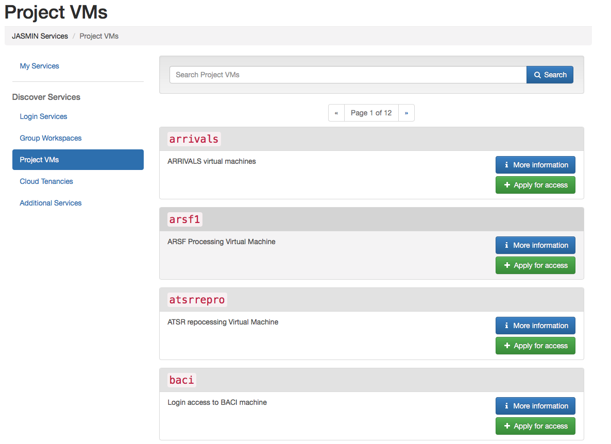
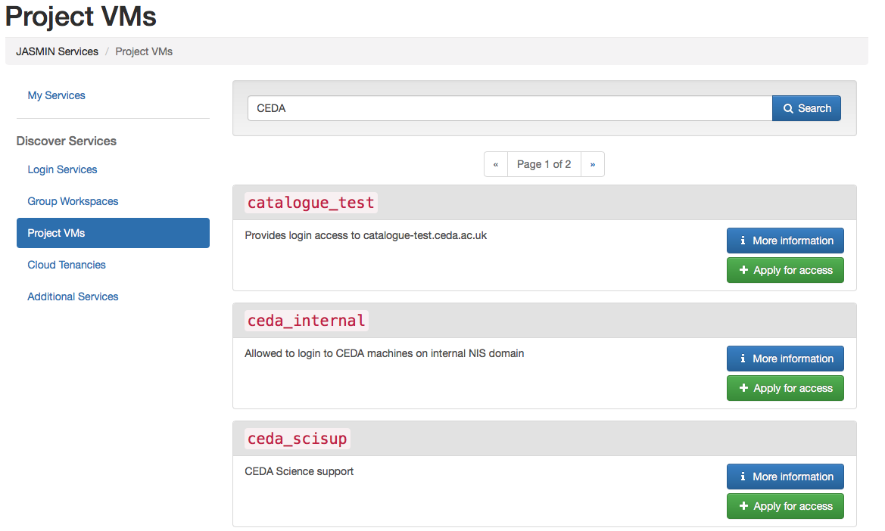
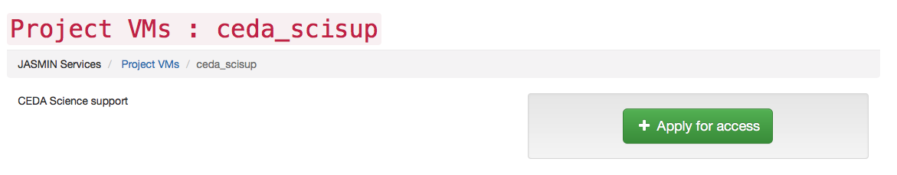
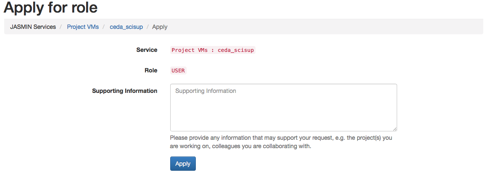
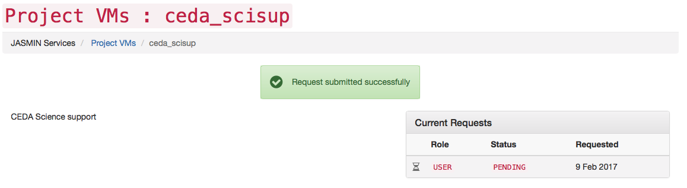

This article introduces the project specific servers. It covers:

  * Available project-specific servers
  * Access request to current servers 
  * New servers request 

## What is a project-specific server?

JASMIN also enables projects to be provided with dedicated servers machines
which can be built with specific software required by the project, or where
access needs to be restricted to members of a project or institution.

## Get Access

On the JASMIN accounts portal, you can apply for access to existing Project
VMs.

Step 1: Select Project VMs from the Discover Services menu on the left

Step 2: You can either browse the page listing or do a search on the Project
VMs. For example here using CEDA as a keyword search and to apply for access
to CEDA_scisup, click apply or look into More information

## Project-specific servers on JASMIN/CEMS

New project specific servers can be requested by contacting the [CEDA
Helpdesk](mailto:support@ceda.ac.uk?subject=JASMIN%20Access%20GWS) directly.
The helpdesk will respond by sending you a questionnaire so we can assess your
specific project needs, however you are encouraged to check the list of
[existing Project
VMs](https://accounts.jasmin.ac.uk/account/login/?next=/services/project_vms/)
to check that a suitable resource does not already exist.

## See also

  * [scientific analysis servers]()

