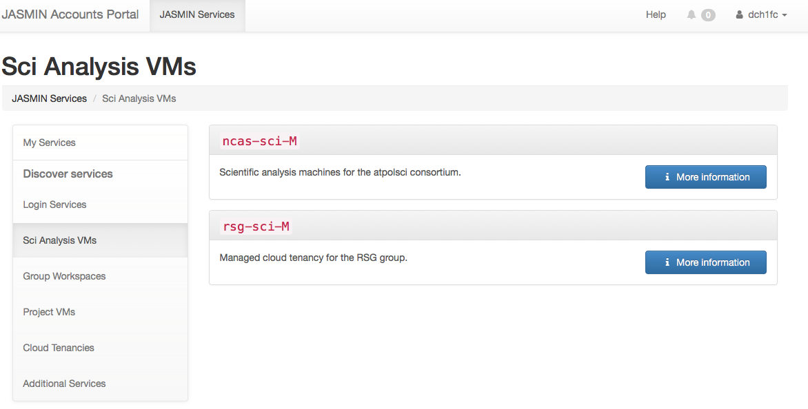
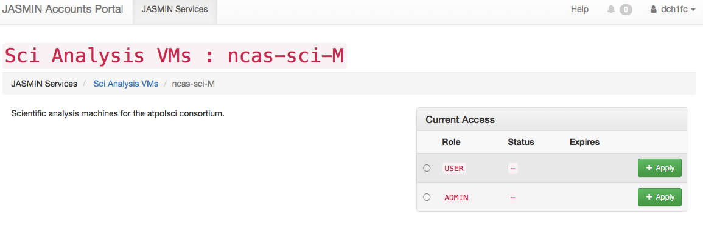
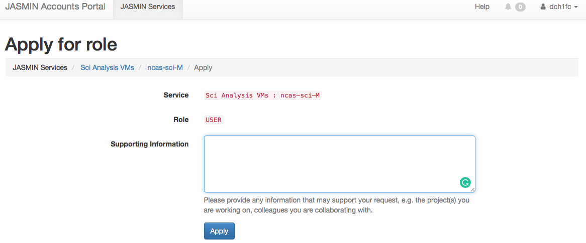
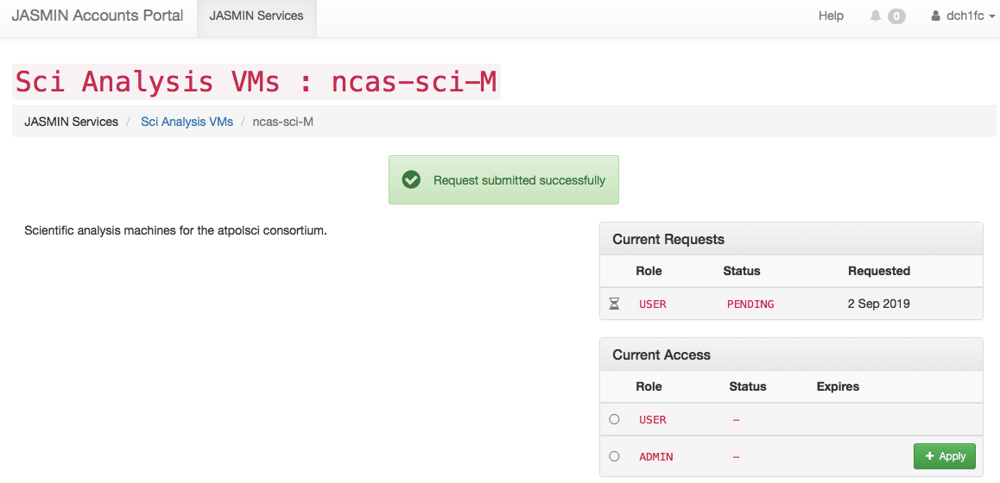
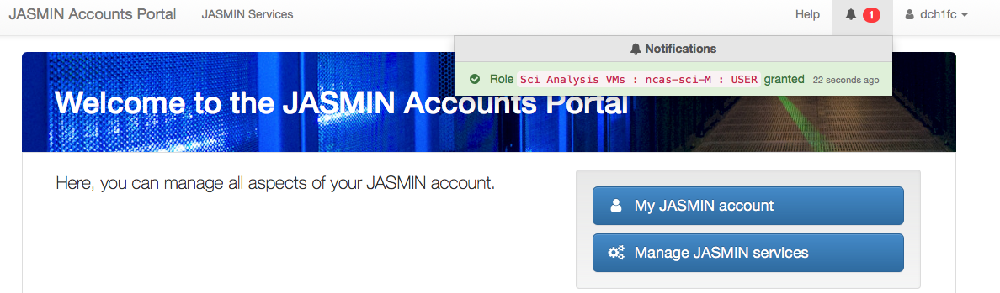
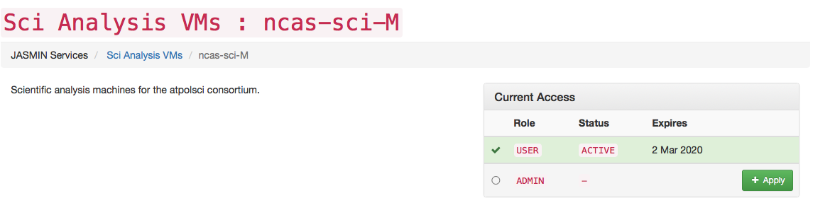
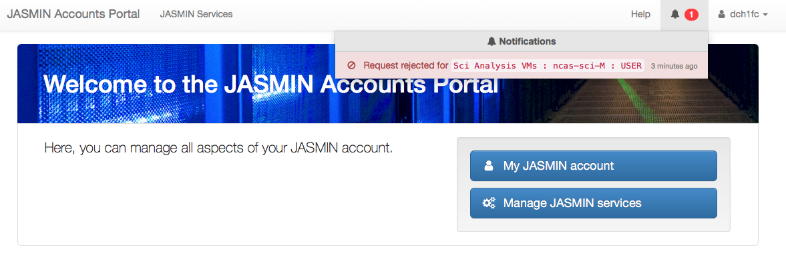
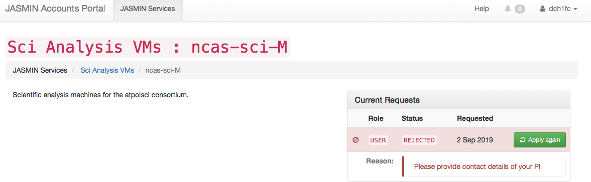

Check which institutions/group you belong to:

NCAS, NCEO, UKMO, RSG

The manager of the tenancy-based Sci will provide you the name of the tenancy.
You can then search for it on your JASMIN accounts portal under the JASMIN
service named `Sci Analysis VMs`.

How to request access to a Sci Analysis VMs

How to SSH login to a Sci analysis VM

How to report issues of a Sci analysis VM

## How to request access to a Sci Analysis VMs

Step 1: Find the Sci Analysis VMs under the Menu 'Discover services`

Step 2: Check the name of the service and the description that your supervisor
or PI recommended you to choose and click "More information"

Step 3: Apply for "USER" role and provide details on your project and a
reference then click "Apply"

Step 4:

Once your request was approved, you will get a notification

If your request was rejected, then reapply and provide further supporting
information

Click on the rejection notification. This will take you to the following page
where you can "Apply again"

## How to SSH login to an institution based Sci Analysis VMs

## How to report issues of an institution based Sci Analysis VMs

