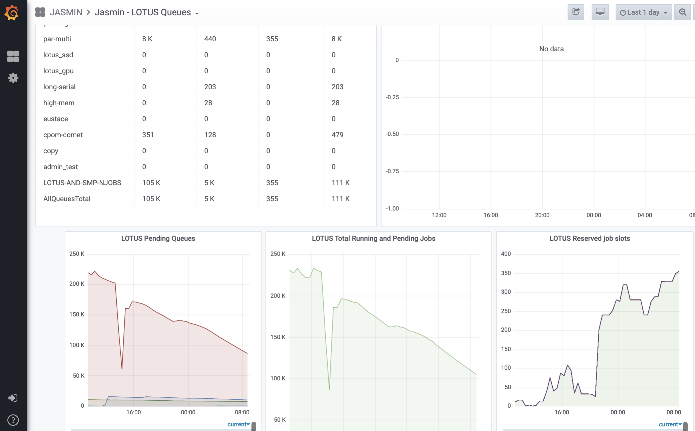

TO UPDATE THE URL

This article explains how to monitor LOTUS status using  JASMIN  dashboard
utility. It covers:

  * LOTUS queues status
  * LOTUS hosts status

## LOTUS status

The [JASMIN dashboard](https://mon.jasmin.ac.uk/) includes an overview of
LOTUS queues/partitions status, including the number of jobs running and
pending, and a detailed view of the load on individual hosts.

Figure 1. Screenshot of the JASMIN dashboard "LOTUS Status" page

