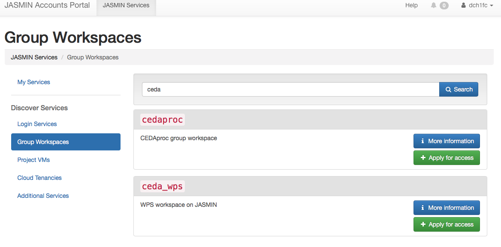
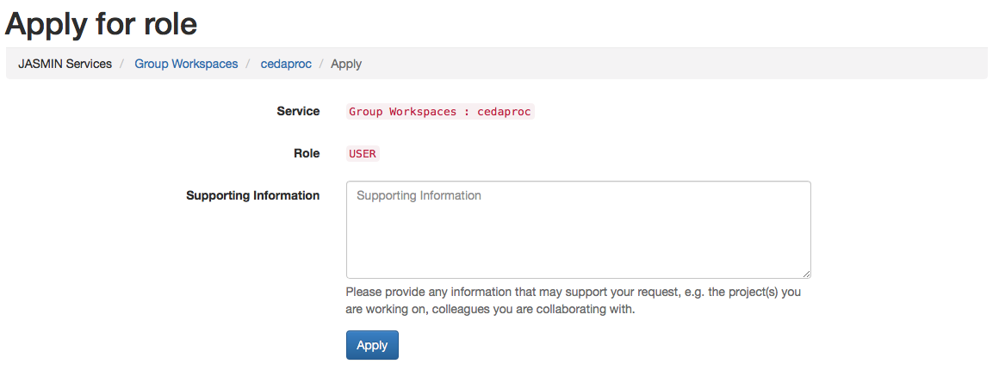
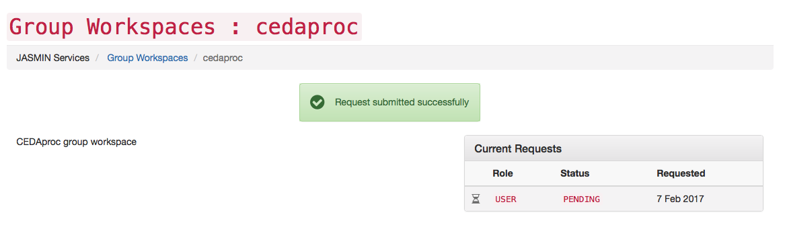
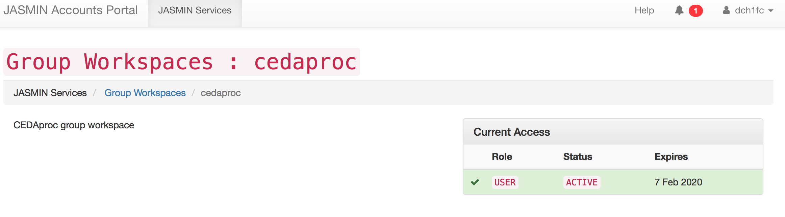
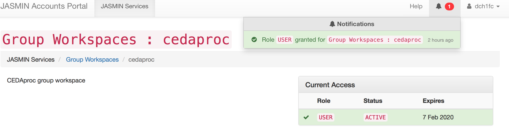
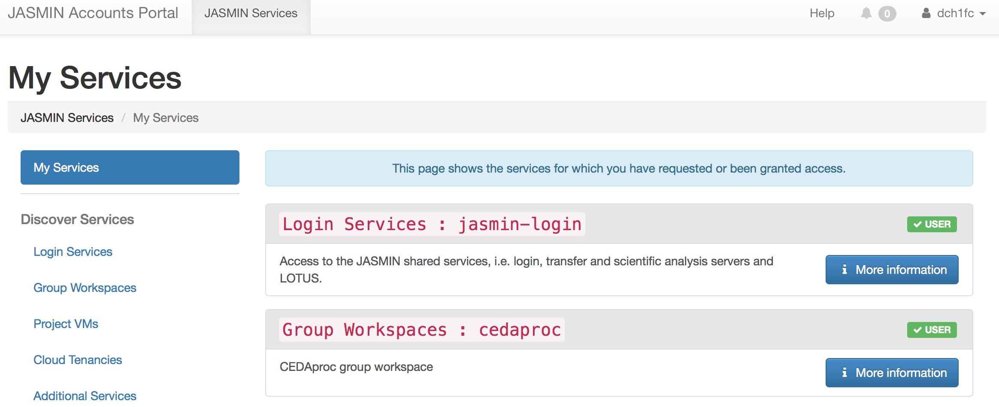

This article explains how to apply for access to a GWS from the JASMIN account
portal. There is a video **tutorial** at [Accessing a group
workspace](https://www.youtube.com/watch?v=J6zW23P1Wf0&index=4&list=PLyBwrm7gQcuV3I1zrI8Rop2WgEP6vPXJL)

**Step 1** : Sign in into your [JASMIN accounts
portal](https://accounts.jasmin.ac.uk/). Navigate to the JASMIN services tab
of the portal then select the group workspaces from "Discover services" menu.
You can search or browse a list of available GWSs. For example here the search
for GWS with name containing CEDA, resulted in two GWSs.

**Step 2:** Select the GWS you are interested in and
provide supporting information. In the following example, the GWS cedaproc was
selected.

**Step 3:** Your request to join a GWS is pending for approval

**Step 4** : You will receive a notification of the outcome of your
application. For example, the request to join an existing GWS cedaproc was
granted and details of this service such as status and expiry date are
displayed below

**Step 5:** Every time a notification is acknowledged the counter is reset or
decremented.

**Finally,** you can view all the services that you currently have access to
or have requested access for under 'My Services'

